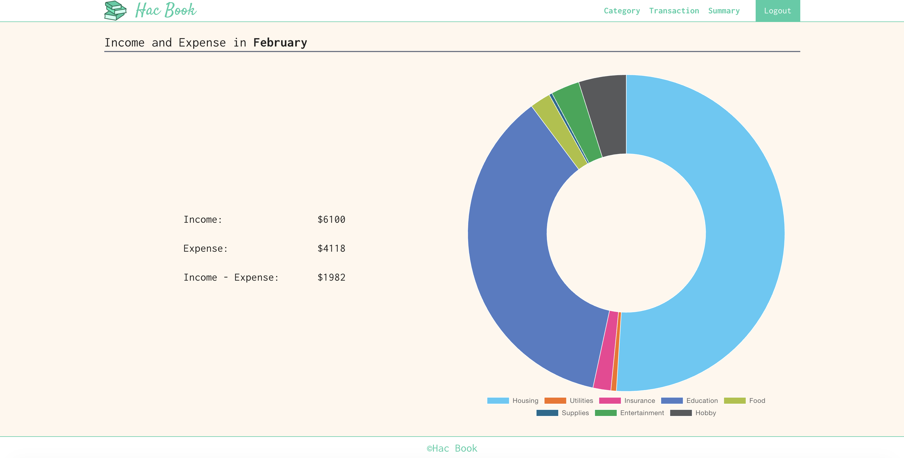

# Hello, I'm Katsuya! 🙂

I'm a software developer with 3+ years of experience specializing in Java and Spring Boot, based in Vancouver, Canada 🇨🇦

## Skills

## Projects

### Hac Book

#### [Hac Book Web](https://github.com/katsu0511/hac_book_web)
This is the frontend application for **Hac Book** – a personal household accounting system. Users can record incomes and expenses, manage categories, and view summaries through a clean and responsive UI.

#### [Hac Book API](https://github.com/katsu0511/hac_book_api)
This is the backend API for **Hac Book** – a personal household accounting application. It provides features for managing incomes and expenses, categories, and summary dashboards for each user.

## Connect with me!

- [LinkedIn](https://www.linkedin.com/in/katsuya-harada-profile/)
